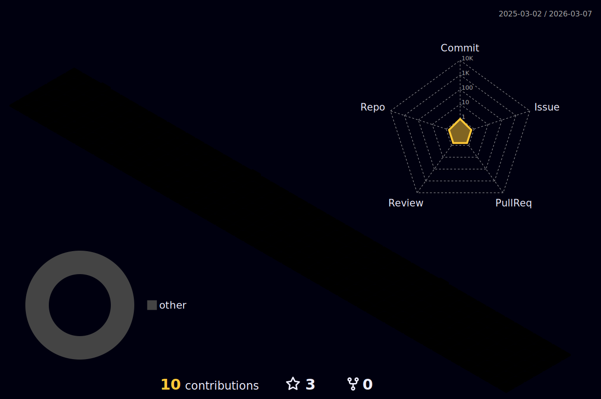

### Hi there 👋
#### ⚡ I’m currently learning : TypeScript e C#;
#### ⚡ Next steps : pós em Engenharia De Software;
#### ⚡ Dreams: Ter uma casa grande;
#### ⚡ Fun fact: Gosto muito de café;

##

## Eu sou o Guilherme Silva,  Um Desenvolvedor Back-End e estudante de Engenharia da Computação. 

 

 

📈 My GitHub Stats

 

 

 

 
📈 My Profile Stats

  
 
 

##

### Languages and Tools:
  

[][python]
[][net]
[][react]
[][vue]
[][node]
[][javascript]
[][typescript]
[][docker]
[][kubernetes]
[][mongo]
[][postgresql]
[][vscode]
[][bash]

##

### Connect with me: 
  

[][instagram]
[][linkedin]
[][mail]

##

 
###

[instagram]: https://www.instagram.com/oguiih_henrii
[linkedin]: https://www.linkedin.com/in/guilherme-henrique-oliveira-silva-g1201bh2/](https://www.linkedin.com/in/guilherme-silvah3nol1/
[mail]: mailto:guiilherme.oliver.sillva@gmail.com
<!-- [webdevplaylist]: https://www.youtube.com/playlist?list=PLkwxH9e_vrAJ0WbEsFA9W3I1W-g_BTsbt
[jsplaylist]: https://www.youtube.com/playlist?list=PLkwxH9e_vrALRJKu7wfXby3MKeflhTu6B
[cssplaylist]: https://www.youtube.com/playlist?list=PLkwxH9e_vrALSdvZuEh6gqQdmDoDIoqz4
[reactplaylist]: https://www.youtube.com/playlist?list=PLkwxH9e_vrAK4TdffpxKY3QGyHCpxFcQ0 -->

[python]: https://www.python.org
[react]: https://reactjs.org
[vue]: https://vuejs.org
[node]: https://nodejs.org/en
[javascript]: https://www.javascript.com
[typescript]: https://www.typescriptlang.org
[docker]: https://www.docker.com
[kubernetes]: https://kubernetes.io
[mongo]: https://www.mongodb.com
[redis]: https://redis.io
[postgresql]: https://www.postgresql.org
[vscode]: https://code.visualstudio.com
[bash]: https://devhints.io/bash
[net]: https://dotnet.microsoft.com/learn/dotnet/what-is-dotnet
