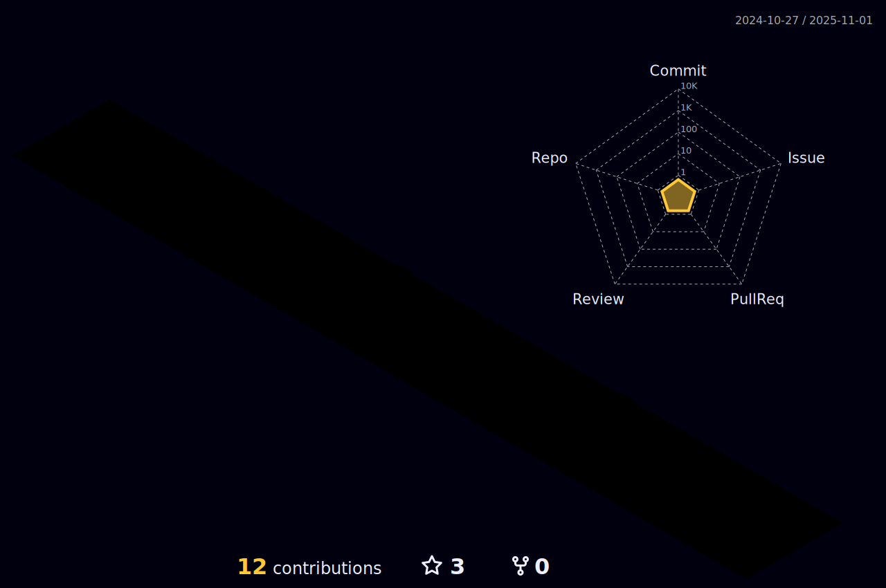

### Hi there 👋

 I’m currently learning :
JavaScript, Node, Vue e C#;
⚡ Fun fact: Gosto muito de café 
##

## Eu sou o Guilherme Silva,  Um Desenvolvedor Back-End e estudante de Ciência Da Computação. Quero me especializar em tecnologias backend e ser um Bom desenvolvedor de software.

 

##
  
  
   
##

 
  
   
  <a href = ""></a
    
 

   

  

